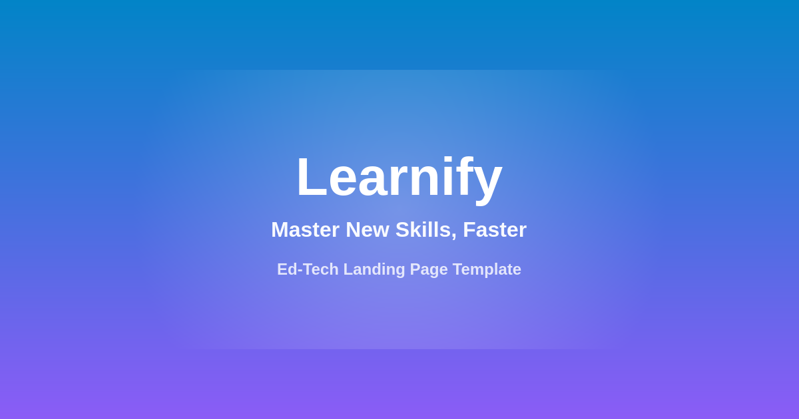

# Learnify — Ed-Tech / Online Learning Landing Page Template

A premium-grade, **100% custom** ed-tech & online learning landing page template built with vanilla HTML, CSS, and JavaScript. No frameworks, no build tools, no dependencies — just open and go.



---

## ✨ Features

| Feature | Detail |
|---|---|
| 🎨 **Modern gradient design** | Sky × violet brand gradient, glassmorphism touches |
| 🌙 **Dark mode** | One-click toggle, persisted in localStorage, honors system preference |
| 📱 **Fully responsive** | Mobile-first, tested at 360px → 1440px+ |
| ⚡ **Fast & lightweight** | No jQuery, no React, no build step. ~30KB total |
| 🎬 **Scroll animations** | IntersectionObserver-based reveal, respects `prefers-reduced-motion` |
| 💰 **Interactive pricing** | Monthly / yearly toggle updates prices instantly |
| 🧭 **Sticky nav + mobile menu** | Smooth-scroll sections, hamburger menu under 900px |
| ♿ **Accessible** | Semantic HTML, ARIA labels, keyboard support, visible focus states |
| 📄 **Ready content** | Hero, logos, features, how-it-works, pricing, testimonials, FAQ, CTA, footer |

## 📂 File Structure

```
edtech-template/
├── index.html              ← Main landing page (all sections)
├── css/
│   └── style.css           ← Complete stylesheet (fully commented)
├── js/
│   └── main.js             ← Interactions (theme, menu, pricing, reveal)
├── assets/
│   └── images/
│       └── og-cover.png    ← Social share image (replace with your own)
└── docs/
    └── DOCUMENTATION.md    ← Full customization guide
```

## 🚀 Quick Start

**Option A — just open it:**

Open `index.html` in any modern browser.

**Option B — local server (recommended):**

```bash
# Python
python3 -m http.server 8000

# or Node
npx serve .
```

Then visit `http://localhost:8000`.

## 🎨 Customize in 5 Minutes

### 1. Brand name & logo

In `index.html`, find `Learnify` (appears ~4 times) and replace with your brand:

```html
<span class="brand-name">YourBrand</span>
```

Swap the inline SVG inside `.brand-mark` for your own logo mark if you like.

### 2. Colors

All colors are CSS variables at the top of `css/style.css`:

```css
:root {
  --primary: #0ea5e9;   /* main brand color (sky)   */
  --accent: #8b5cf6;    /* secondary accent (violet)*/
  --accent-2: #a78bfa;  /* extra accent             */
}
```

### 3. Content

Every section is plain HTML — just edit the text. The sections are clearly commented in `index.html`:

- `HERO` — headline, subtitle, CTAs
- `FEATURES` — the 6 feature cards
- `HOW IT WORKS` — 3 steps
- `PRICING` — 3 plans + billing toggle
- `TESTIMONIALS` — 3 reviews
- `FAQ` — expandable `<details>` items
- `FOOTER` — links & legal

### 4. Images

Replace `assets/images/og-cover.png` with your own 1200×630 social preview image. The featured dashboard in the hero is **pure CSS/SVG** — no image needed.

## 📦 What's Included When You Buy

- Full template source code (HTML/CSS/JS)
- Complete documentation (this file + `docs/DOCUMENTATION.md`)
- Lifetime free updates
- Commercial license — use in unlimited personal & client projects
- 14-day money-back guarantee

## 🙋 Support

Email: **abinawahasan@gmail.com** — we reply within 24 hours on business days.

---

© 2026 Nexus Templates. All rights reserved.